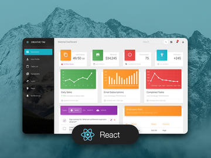
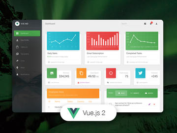

# [Material Dashboard React](https://demos.creative-tim.com/material-dashboard-react/#/dashboard) 

     

Material Dashboard React is a free Material-UI Admin with a fresh, new design inspired by Google's Material Design. We are very excited to introduce our take on the material concepts through an easy to use and beautiful set of components. Material Dashboard React was built over the popular Material-UI framework.

Material Dashboard React makes use of light, surface and movement. The general layout resembles sheets of paper following multiple different layers, so that the depth and order is obvious. The navigation stays mainly on the left sidebar and the content is on the right inside the main panel.

Material Dashboard React comes with 5 color filter choices for both the sidebar and the card headers (blue, green, orange, red and purple) and an option to have a background image on the sidebar.

Material Dashboard React was created using [create-react-app](https://github.com/facebook/create-react-app) and it uses a framework built by our friend [Olivier - Material-UI v3.1.0](https://github.com/mui-org/material-ui), who did an amazing job creating the backbone for the material effects, animations, ripples and transitions. Big thanks to his team for the effort and forward thinking they put into it.

Special thanks go to:

- [React-chartist](https://github.com/fraserxu/react-chartist) for the wonderful charts.

We are very excited to share this dashboard with you and we look forward to hearing your feedback!

You can find the Github Repo here.

## Table of Contents

- [Versions](#versions)
- [Demo](#demo)
- [Quick Start](#quick-start)
- [Documentation](#documentation)
- [File Structure](#file-structure)
- [Browser Support](#browser-support)
- [Resources](#resources)
- [Reporting Issues](#reporting-issues)
- [Technical Support or Questions](#technical-support-or-questions)
- [Licensing](#licensing)
- [Useful Links](#useful-links)

## Versions

| HTML                                                                                                                          | React                                                                                                                                 | Vue                                                                                                                                   | Angular                                                                                                                                           |
| ----------------------------------------------------------------------------------------------------------------------------- | ------------------------------------------------------------------------------------------------------------------------------------- | ------------------------------------------------------------------------------------------------------------------------------------- | ------------------------------------------------------------------------------------------------------------------------------------------------- |
|  |  |  |  |

## Demo

| Dashboard                                                                                                             | User Profile                                                                                                               | Tables                                                                                                           | Maps                                                                                                       | Notification                                                                                                                        |
| --------------------------------------------------------------------------------------------------------------------- | -------------------------------------------------------------------------------------------------------------------------- | ---------------------------------------------------------------------------------------------------------------- | ---------------------------------------------------------------------------------------------------------- | ----------------------------------------------------------------------------------------------------------------------------------- |
|  |  |  |  |  |

[View More](https://demos.creative-tim.com/material-dashboard-react/#/dashboard).

## Quick start

1. Install dependencies: `npm install`
2. Run the app: `npm start`
3. Visit the app at `http://localhost:3000`

## Resources

- Material UI: https://v4-1-3.material-ui.com/
- Demo: https://demos.creative-tim.com/material-dashboard-react
- Documentation: https://demos.creative-tim.com/material-dashboard-react/#/documentation/tutorial
